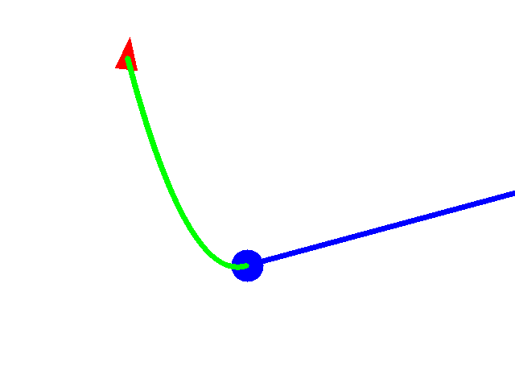
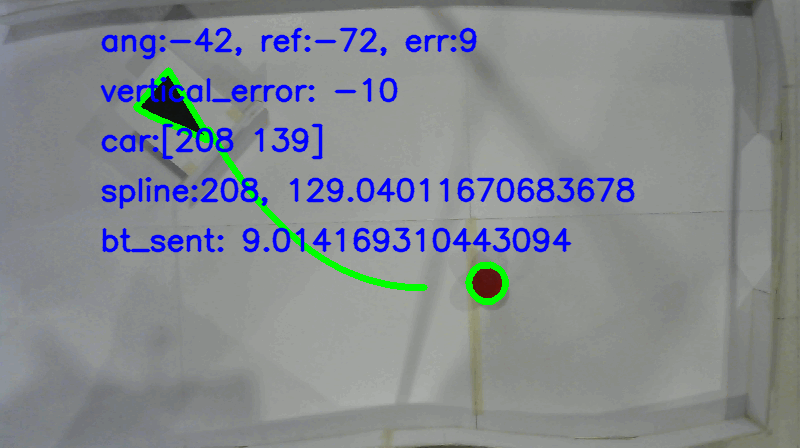

# Virutal Line Follower Robot
Using computer vision in Python with OpenCV and Arduino for controlling the robot.

There are three main components:
- Main Computer
- USB WebCam
- Arduino Robot

The programs follow these steps
1. Take photo
2. Find car and ball, determine position
3. Create a trajectory form car to ball
4. Find car orientation
5. Calculate error from desired position based on trajectory
6. Orient car by moving both motors on different directions

Repeat until the car hits the ball

4. Take photo
5. Find car position and orientation
6. Mesaure error (trajectory vs current)
    - Vertical (y-axis) position
    - Orientation
7. Send error to robot
8. Compensate motor velocity based on error

The camera is placed around 2m above the ground and will take images of the robot and ball. The floor must be white. These images are processed using OpenCV in Python to identify contours and then find the car and ball. The car is identified by the triangle on top. The ball is simply identified as a circle.

After the trajectory has been created, the car must be correctly oriented and then must follow the trajectory. This is done in real-time by taking photos, processing them, sending the error information to the robot, and controlling the motors speed.

Project by:

- Mario Valverde
- Omar Beltrán
- Antonio Zamora